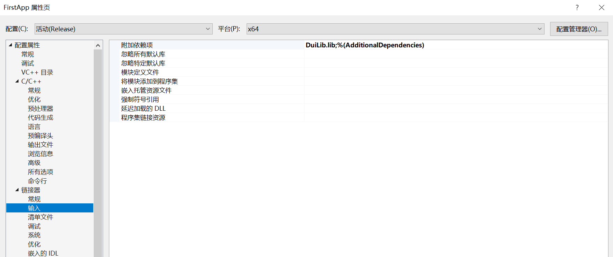

# 快速上手

  - [创建一个Windows桌面应用程序](#创建一个Windows桌面应用程序)
  - [配置工程属性](#配置工程属性)
  - [创建窗口类](#创建窗口类)
  - [创建字体文件](#创建字体文件)
  - [创建窗口布局文件](#创建窗口布局文件)
  - [创建窗口并显示](#创建窗口并显示)
  - [运行效果](#运行效果)


## 创建一个Windows桌面应用程序

使用Visual Studio新建一个Windows桌面应用程序FirstApp（整个示例将基于Release配置、x64平台），将生成的代码清理到只保留wWinMain函数。


```cpp
int APIENTRY wWinMain(_In_ HINSTANCE hInstance,
                     _In_opt_ HINSTANCE hPrevInstance,
                     _In_ LPWSTR    lpCmdLine,
                     _In_ int       nCmdShow)
{
    UNREFERENCED_PARAMETER(hPrevInstance);
    UNREFERENCED_PARAMETER(lpCmdLine);

    return 0;
}
```

将编译构建好的整个output文件夹拷贝到解决方案PC_UIKit_Demo.sln根目录下，将output文件夹重命名成PC_UIKit。并将编译构建生成的二进制*.dll拷贝到FirstApp的输出目录x64\Release\下。

```
├─PC_UIKit_Demo ├─FirstApp

                ├─PC_UIKit

                ├─x64├─Release├─*.dll

                ├─PC_UIKit_Demo.sln
```


## 配置工程属性

配置附加包含目录


配置附加库目录


配置附加依赖项



配置语言符合模式


## 创建窗口类

新建一个窗口类FirstWnd

```cpp
class FirstWnd : public WindowImplBase
{
public:
    CDuiString GetSkinFile() override;
    LPCTSTR GetWindowClassName(void) const override;
};
```

```cpp
CDuiString FirstWnd::GetSkinFile()
{
    return L"layout/FirstWnd.xml";
}

LPCTSTR FirstWnd::GetWindowClassName(void) const
{
    return L"FirstWnd";
}
```

## 创建字体文件

```xml
<?xml version="1.0" encoding="utf-8"?>
<Window>
    <Font id="0" name="微软雅黑" size="9" bold="false" default="true"/>
    <Font id="1" name="微软雅黑" size="14" bold="true" />
    <Font id="2" name="微软雅黑" size="15" bold="false" />
</Window>
```

## 创建窗口布局文件

```xml
<?xml version="1.0" encoding="UTF-8" standalone="yes" ?>
<Window caption="0,0,0,32" size="1024, 640" showshadow="true" shadowimage="drawable/img_shadow_bk.png" shadowcorner="54,30,54,78">
<Include source="layout/font.xml"/>
    <VerticalLayout>
        <HorizontalLayout>
            <VerticalLayout bkcolor="#ffeeeeee" width="200">
                <HorizontalLayout height="214"/>
                <VerticalLayout name="menuPanel">
                    <HorizontalLayout height="36">
                        <HorizontalLayout width="16"/>
                        <Option name="quickStartMenu" height="36"
                          borderround="16,16" width="168"
                          group="menuTitle"  selected="true" text="快速入门"
                          font="1" align="left" valign="vcenter" textpadding="40,6,8,6" endellipsis="true" textcolor="#FF333333" hottextcolor="#FF333333" selectedtextcolor="#FF0A59F7"
                          hotbkcolor="#0C000000"  selectedbkcolor="#190A59F7" pushedbkcolor="#19000000" selectedfont="1"
                          normalimage=" file='drawable/ic_quickstart_normal.png' reverse='true' dest='8,6,32,30'"
                          hotimage=" file='drawable/ic_quickstart_normal.png' reverse='true' dest='8,6,32,30'"
                          pushedimage=" file='drawable/ic_quickstart_normal.png' reverse='true' dest='8,6,32,30'"
                          selectedimage=" file='drawable/ic_quickstart_hover.png' reverse='true' dest='8,6,32,30'"/>
                        <HorizontalLayout width="16"/>
                    </HorizontalLayout>
                    <Control height="5"/>
                    <HorizontalLayout height="36">
                        <HorizontalLayout width="16"/>
                        <Option name="AboutMenu" height="36"
                          borderround="16,16" width="168"
                          group="menuTitle" text="更多"
                          font="1" align="left" valign="vcenter" textpadding="40,6,8,6" endellipsis="true" textcolor="#FF333333" hottextcolor="#FF333333" selectedtextcolor="#FF0A59F7"
                          hotbkcolor="#0C000000"  selectedbkcolor="#190A59F7" pushedbkcolor="#19000000" selectedfont="1"
                          normalimage=" file='drawable/ic_search_normal.png' reverse='true' dest='8,6,32,30'"
                          hotimage=" file='drawable/ic_search_normal.png' reverse='true' dest='8,6,32,30'"
                          pushedimage=" file='drawable/ic_search_normal.png' reverse='true' dest='8,6,32,30'"
                          selectedimage=" file='drawable/ic_search_hover.png' reverse='true' dest='8,6,32,30'"/>
                        <HorizontalLayout width="16"/>
                    </HorizontalLayout>
                </VerticalLayout>
            </VerticalLayout>
            <TabLayout name="tabContainer" bkcolor="#fffcfcfc">
                <HorizontalLayout>
                    <Text align="center" valign="vcenter" font="2" text="欢迎使用PC_UIKit!"/>
                </HorizontalLayout>
                <HorizontalLayout>
                    <Text align="center" valign="vcenter" font="2" text="更多关于PC_UIKit新特性，敬请期待!"/>
                </HorizontalLayout>
            </TabLayout>
        </HorizontalLayout>
        <HorizontalLayout float="true" pos="200,0,1024,32">
            <HorizontalLayout/>
            <Button name="minbtn" width="48" height="32" tooltip="最小化"
              normalimage="file='drawable/ic_min_normal.png'"
              hotimage="file='drawable/ic_min_hover.png'"
              pushedimage="file='drawable/ic_min_pressed.png'" IsNcHit="false"/>
            <Button name="closebtn" width="48" height="32" tooltip="关闭"
              normalimage="file='drawable/ic_close_normal.png'"
              hotimage="file='drawable/ic_close_hover.png'"
              pushedimage="file='drawable/ic_close_pressed.png'" IsNcHit="false"/>
        </HorizontalLayout>
    </VerticalLayout>
</Window>
```

## 创建窗口并显示

```cpp
int APIENTRY wWinMain(_In_ HINSTANCE hInstance,
                     _In_opt_ HINSTANCE hPrevInstance,
                     _In_ LPWSTR    lpCmdLine,
                     _In_ int       nCmdShow)
{
    UNREFERENCED_PARAMETER(hPrevInstance);
    UNREFERENCED_PARAMETER(lpCmdLine);

    CPaintManagerUI::SetInstance(hInstance);
    CPaintManagerUI::SetResourcePath(CPaintManagerUI::GetInstancePath() + L"res");

    FirstWnd* firstWnd = new (std::nothrow) FirstWnd();
    firstWnd->Create(nullptr, L"FirstWnd", UI_WNDSTYLE_FRAME, 0L);
    firstWnd->CenterWindow();
    firstWnd->ShowWindow();

    CPaintManagerUI::MessageLoop();

    return 0;
}
```

## 运行效果

