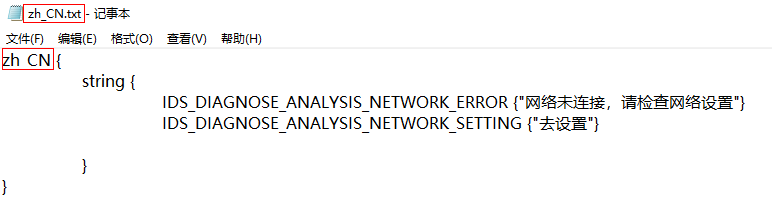
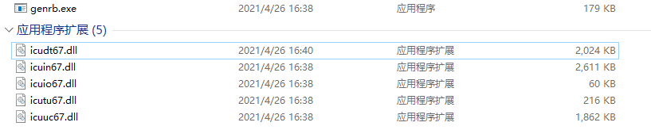
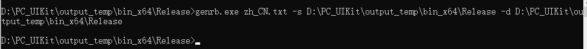
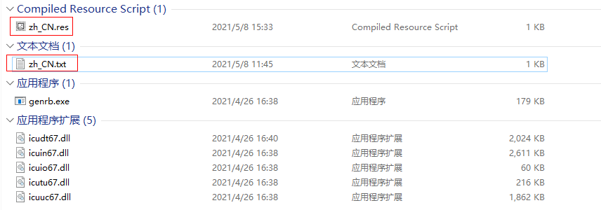

# 构建多语言资源文件（多语言类）

  - [多语言源文件格式](#多语言源文件格式)
  - [构建PC_UIKit](#构建PC_UIKit)
  - [生成资源文件](#生成资源文件)

## 多语言源文件格式

多语言源文件以文本文件存储，格式如下：

一般以语言.txt的形式作为文件名，每种语言一个文件，前两行和后两行格式固定，中间按照Key {"Value"}的形式增加Key-Value，不同的语言Key相同，Value不同。

## 构建PC_UIKit

构建PC_UIKit会先编译icu，生成genrb.exe及其动态库，如下图所示：

## 生成资源文件

genrb.exe zh_CN.txt -s D:\PC_UIKit\output_temp\bin_x64\Release -d
D:\PC_UIKit\output_temp\bin_x64\Release

使用如上命令，用genrb.exe依次传递，多语言源文件(多个用空格隔开)  –s多语言源文件存放目录 –d 输出目录，命令与执行结果如下图所示：

每个多语言源文件会生成一个对应的.res文件即为多语言的资源文件。